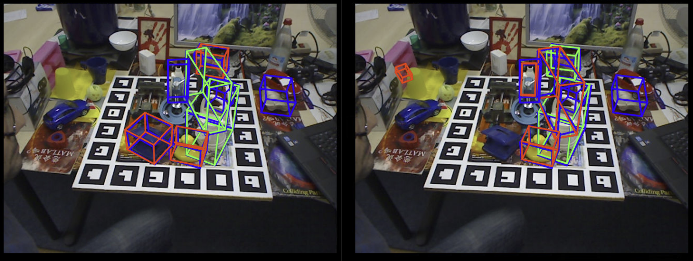

# w251 Spring 2023 Final Project

## Project code name: Rover
#### Team Casey Hsiung, Daniele Grandi, Evan Fjeld, Mon Young, Preethi Raju

### Links
- Our demo video
- Our paper
- our presentation slides

## Introduction
(from the paper and the presentation)

This repository contains information and codes we use to build our Rover.

### The Architecture Pipeline

-  Theoretical application of our CASAPose model implementation packaged and deployed on a Rover.

### Folder structure

- [dataset](dataset) - Dataset creation step-by-step. More detail in this folder's README.md file
- [casapose](casapose) - Our training, validation, and eval environment. More detail in this folder's README.md file
- [csv_outputs](csv_outputs) - Our training, validation, and eval output files. It is used to generate plots and tables in the [251_final_project_plots_tables.ipynb](251_final_project_plots_tables.ipynb) file.
- [edge](edge) - Our docker and codes to place on the hover edge device. More detail in this folder's README.md file
- [workings](workings) - Our notes, drafts, and test code for our project.

Details are in our paper and presentation file. Noticeable highlights
- We synthetically created our new headphone object 
- We created our dataset containing 15 Linemod objects and our headphones object. Our dataset contains 5,000 synthetic images with associated JSON and meshes files.
- Our synthetic dataset outperforms the PBR dataset
- Our synthetic eval test dataset outperforms the LMO eval test dataset (as expected)

Photo comparisons and graphs

-  baseline vs training2 evaluated with LM-O dataset. Our training2 detects glue, has better accuracy on cat, but mis-detect ape.

### CASAPose Citation

Gard, Niklas, Anna Hilsmann, and Peter Eisert. "CASAPose: Class-Adaptive and Semantic-Aware Multi-Object Pose Estimation." arXiv preprint arXiv:2210.05318 (2022).