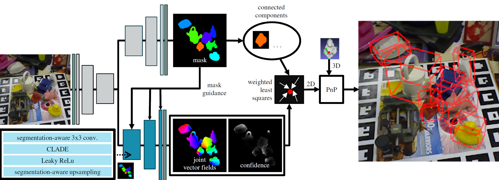

# Training and Evaluation

We use CASAPose's multi-object 6 DoF pose estimation model to train with LM (linemod) dataset. The LM dataset has 15 texture-less household objects with discriminative color, shape and size. We picked 8 out of 15 objects. In addition, we added our own object (the obj_000016, the headphones) to create our trained .h5 file.

- obj_000001 = ape
- obj_000005 = wateringcan
- obj_000006 = cat
- obj_000008 = driller
- obj_000009 = duck
- obj_000010 = eggbox
- obj_000011 = glue
- obj_000012 = holepuncher
- obj_000016 = headphones (the object created by our team)

## Steps to create our model training environment

### Step 1: Clone this GitHub repository

First, clone this GitHub repository. For example, under your ubuntu workstation:

```bash
cd ~
git clone git@github.com:mon203/w251_final_project.git
```

### Step 2: Setup Conda environment
Setup the environment and install basic requirements using conda. Tensorflow 2.9.1 is compatible with CUDA 11.2 and cuDNN 8.1.

```bash
cd ~/w251_final_project/casapose

conda env create -f environment.yml

conda activate casapose
```

### Step 3: Dataset Preparation

Download the following zip files from this [Google Share](https://drive.google.com/drive/folders/1ydFg2CGQtmTwpokuEPQwajv1ChsSggJW?usp=sharing) and place them under your `~/w251_final_project/casapose/import_data/tmp/` folder. This folder already exists.
- lm_train_pbr.zip
- lm_models.zip
- lm_base.zip
- lm_test_all.zip
- lmo_test_all.zip
- lmo_base.zip
- lm_test_bop19.zip

The easiest way to do this is by using `gdown`

```bash
pip install gdown

cd ~/w251_final_project/casapose/import_data/tmp/

gdown --id 1jmB1NryfngMSM93ZGyFNjd5lO8MkwoFG
gdown --id 1eS90Sohb1As5k22XBpZOGHahwDwHD2in
gdown --id 1M7kR_rXPYd-g4e25d69VhPl9rAQtb-He
gdown --id 1ReW56kC5jyGJTEHe2ppXdTX6t898bQt8
gdown --id 1zfcusX1paUO0FTla5xN7YKh8qbhyGWtG
gdown --id 1LeNWTPACxHu9ggEYQJDC3JGDZ5Mppwcr
gdown --id 1YY6BPyW7YYtV6XxHlEtuWz4m7cS_qwld
```

Next, run the following commands to prepare data with the data preparation script.

```bash
export DATAPATH=~/w251_final_project/casapose/import_data/

cd ~/w251_final_project/casapose

python util_scripts/prepare_data.py -d $DATAPATH -lmo 

python util_scripts/prepare_data.py -d $DATAPATH -lm 

python util_scripts/prepare_data.py -d $DATAPATH -pbr

rm -r ${DATAPATH}tmp
```

### Step 4: Install a Docker container

To setup and run a CASAPose docker container:

```bash
# build the docker container
docker build -t "casapose:Dockerfile" .

# run this for a single gpu
docker run -it --gpus '"device=0"' --ulimit memlock=-1 --ulimit stack=67108864 \
    --rm --shm-size=2g -e "CUDA_VISIBLE_DEVICES=0" -e "NVIDIA_VISIBLE_DEVICES=0" \
    -v $DATAPATH:/workspace/data -v $(pwd):/workspace/CASAPose casapose:Dockerfile bash

# or, run this for multi gpu
docker run -it --gpus all --ulimit memlock=-1 --ulimit stack=67108864 \
    --rm --shm-size=2g -v $DATAPATH:/workspace/data \
    -v $(pwd):/workspace/CASAPose casapose:Dockerfile bash
```

Once inside the CASAPose docker container, run the following to start the training.

## Training

Example of training 8-object model with our training data.

```bash
python train_casapose.py -c config/config_8.ini \
    --data $DATAPATH/lm/train_pbr  \
    --datatest $DATAPATH/lm/val_pbr \
    --datameshes $DATAPATH/lm/models
```
Use the `config_8.ini` file to change other parameters (batchsize, gpus etc.)

## Testing

Example of testing the 8-object model with Linemod Occlusion Dataset

```bash
python test_casapose.py -c config/config_8.ini \
    --load_h5_weights 1 \
    --load_h5_filename result_w \
    --datatest $DATAPATH/lmo/test \
    --datameshes $DATAPATH/lmo/models \
    --train_vectors_with_ground_truth 0 \
    --save_eval_batches 1
```

To run the test without going through the training, you can download our training file here:

```bash
cd ~/w251_final_project/casapose/output/data/pretrained_models/

# download the pre-train weight file
gdown --id 1uhQT3xgV3c8A83sl4wEwbcL7A0C_5VFx

# use this pre-train weight file for testing
python test_casapose.py -c config/config_8.ini \
    --load_h5_weights 1 \
    --load_h5_filename ../../../data/pretrained_models/result_w \
    --datatest $DATAPATH/lmo/test \
    --datameshes $DATAPATH/lmo/models \
    --train_vectors_with_ground_truth 0 \
    --save_eval_batches 1
```

The training and testing output are saved under the `~/w251_final_project/casapose/output` folder.

### References: CASAPose related information
- [CASAPose GitHub](https://github.com/fraunhoferhhi/casapose)
- [CASAPose Paper](https://iphome.hhi.de/gard/papers/bmvc2022_gard_hilsmann_eisert.pdf)



